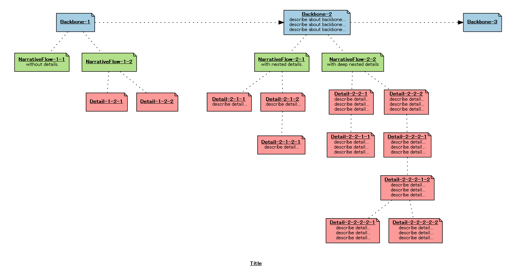

# userstory_map_generator
Simple tool to generate png image of user story map from markdown like text.


## Description
User story mapping is a method for software development. In First, describe user activity as "Backbone" and drill down details.
In this method, it is desirable to put post-its on the floor or wall and discuss.
However, in offshore and remote development, text and image files are necessary for sharing information and recognition.
With this tool, you can describe a user story map as a subset of markdown and convert it to an image.


## Usage
Ruby2.x is required.

1. install gems

  ```
bundle install --path=vendor/bundle
```

2. run tool
  ```
bundler exec ruby -E utf-8 userstory_map_generator.rb ${INPUT_FILE_NAME} ${OUTPUT_IMAGE_NAME}
```

  For example, generate image from sample.txt.
  ```
bundler exec ruby -E utf-8 userstory_map_generator.rb sample.txt output
```

Generated image.
  

### Format for describing user story map
Input text must be formatted like bellow.

```
# Title
- Backbone-1
    - NarrativeFlow-1-1
      without details.
    - NarrativeFlow-1-2
      with details.
        - Detail-1-2-1
          describe detail...
            - Detail-1-2-1-1
              describe detail...
              describe detail...
            - Detail-1-2-1-1
              describe detail...
              describe detail...
        - Detail-1-2-2
          describe detail...
          describe detail...
```

This format is a subset of markdown format.
- Header is a title of this map.
- A list element correspond to a post-it
- Nested list describes architecture of user story map.
    - __Four white spaces are the unit of indentation__
    - Indent level 0: backbone
    - Indent level 1: narrative flow
    - Indent level 2 or higher: details and tasks

## Licence

[MIT Licence](https://github.com/tcnksm/tool/blob/master/LICENCE)


## Author
https://github.com/ka-ka-xyz
