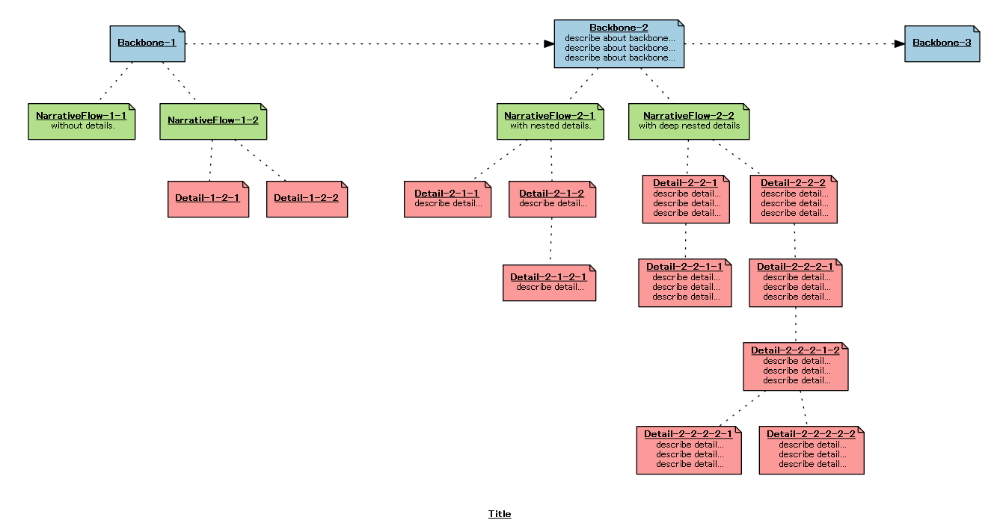

# userstory_map_generator
マークダウン的なテキストからユーザーストーリーマップを生成するためのシンプルなツールです。


## Description
ユーザーストーリーマッピングはソフトウェア開発のための手法の一つです。最初にユーザのアクティビティを「バックボーン」として記述し、詳細へと落とし込んで行きます。
この手法では、ポストイットと壁や床を使い、ディスカッションすることが推奨されています。しかしながら、オフショア開発やリモート開発などでは、情報共有や認識合わせのためにテキストや画像ファイルを使う必要があります。
このツールを使うことで、ユーザーストーリーマップをマークダウンのサブセット記法として記述し、画像へと変換することが出来ます。


## Usage
Ruby2.xが必要です

1. gemをインストール

  ```
bundle install --path=vendor/bundle
```

2. ツールを実行
  ```
bundler exec ruby -E utf-8 userstory_map_generator.rb ${INPUT_FILE_NAME} ${OUTPUT_IMAGE_NAME}
```

  sample.txtから画像を生成する場合のサンプル.
  ```
bundler exec ruby -E utf-8 userstory_map_generator.rb sample.txt output
```

生成される画像
  

### ユーザーストーリーマップを記述するためのフォーマット
入力用テキストは以下のようにフォーマットされている必要があります。

```
# Title
- Backbone-1
    - NarrativeFlow-1-1
      without details.
    - NarrativeFlow-1-2
      with details.
        - Detail-1-2-1
          describe detail...
            - Detail-1-2-1-1
              describe detail...
              describe detail...
            - Detail-1-2-1-1
              describe detail...
              describe detail...
        - Detail-1-2-2
          describe detail...
          describe detail...
```

このフォーマットはmarkdownのサブセットです
- ヘッダ要素はマップのタイトルとなります
- 一つのリスト要素は一つのポストイットに対応します
- ネストしたリストはユーザーストーリーマップの構造を示します
    - __4つのホワイトスペースで一つのインデントとなります__
    - インデントレベル 0: backbone
    - インデントレベル 1: narrative flow
    - インデントレベル 2 またはそれ以上: details and tasks

## Licence

[MIT Licence](https://github.com/tcnksm/tool/blob/master/LICENCE)


## Author
https://github.com/ka-ka-xyz
